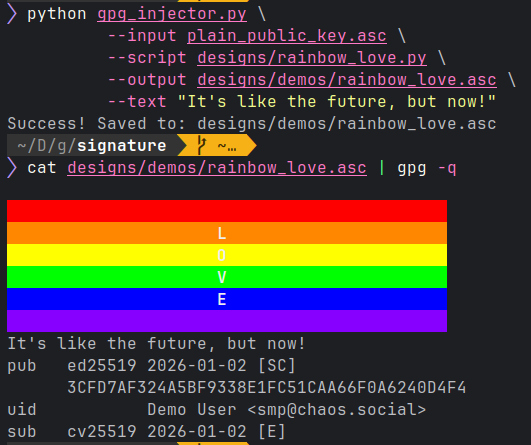

# GPG ANSI Art Injector

A Python tool I vibed to inject colorful ANSI art and text into your OpenPGP public key. When someone fetches your key using `curl` or `cat`, they see your custom design before the standard GPG key block.

Inspired by the key hosted at [lexi.re/pgp](https://lexi.re/pgp) which I saw in the 39C3 talk about GPG, more at [gpg.fail](https://gpg.fail).

Created by [smp@chaos.social](https://chaos.social/@smp) for absolute no sane reason.

### *Feel free to create pull requests including new desings!*

## Demo

*You can find additional screenshots in [DEMO.md](DEMOS.md).*



## 🎨 How It Works

Standard PGP software processes input as a stream of packets. This tool exploits that behavior by prepending a **Literal Data Packet (Tag 11)** containing raw ANSI escape codes immediately before your **Public Key Packet (Tag 6)**.

1.  **Packet 1 (Literal Data):** Contains your ANSI art. `gpg` (and shells) interpret this as "text to display" and print it to the console, rendering the colors.
2.  **Packet 2 (Public Key):** The actual key data. `gpg` recognizes the start of the key structure and processes it normally.

This allows the file to remain a valid, importable GPG key while displaying custom art in the terminal.

## Usage

### 1. Prerequisites
* Python 3.x
* No external dependencies required (uses standard library).

### 2. The Command
Run the injector script to combine your clean public key with a design script.

```bash
python3 gpg_injector.py \
    --input your_clean_key.asc \
    --script designs/warning.py \
    --output result_key.asc \
    --text "Verifying Identity... [OK]"
```


#### Arguments:

* -i, --input: Path to your original, clean public key (ASCII armored).
* -s, --script: Path to the Python module containing the design logic.
* -o, --output: Path to save the final "hacked" key.
* -t, --text: (Optional) Custom text to display below the art (e.g., instructions).

## Test it!

You can test it locally by using cat.

``` 
cat result_key.asc | gpg -q
```

Or upload `result_key.asc` to your server or GitHub. Then test it:

``` 
curl -s https://example.com/key.asc | gpg
```

## 🖌️ Creating New Designs

Designs are modular Python scripts. You can write your own or ask an AI to generate them for you.

### Example Design Module (designs/warning.py)
A design script must define exactly one function: get_payload(custom_text).

```python
def get_payload(custom_text=""):
    red_bg = "\033[41m"
    white_fg = "\033[97m"
    reset = "\033[0m"
    
    msg = " DANGER: UNAUTHORIZED ACCESS "
    
    # Simple box logic
    line = f"{red_bg}{white_fg}{msg}{reset}"
    
    art = f"\n{line}\n"
    
    if custom_text:
        art += f"{custom_text}\n"
    else:
        art += "\n"
        
    return art
```

#### AI Prompt for new Templates

Want a new design? Copy and paste this prompt into ChatGPT, Claude, or Gemini:

```
I need a Python module for a CLI tool that injects ANSI art into PGP keys.

Please write a Python script that defines exactly one function: def get_payload(custom_text=""):

Requirements:

The function must return a single string containing the ANSI art.

It must handle the custom_text argument: if present, append it below the art with a newline; if empty, just ensure the string ends with a newline.

Use standard ANSI escape codes for colors (e.g., \033[48;5;Nm for 256-color background).

Ensure the art resets colors (\033[0m) at the end of every line to prevent bleeding.

Start the string with \n to separate it from the shell command.

The Design Request: [INSERT YOUR IDEA HERE, e.g., "A retro neon synthwave sunset using block characters"]

```

## Notes & Disclaimer
GUI Compatibility: While this works perfectly in terminals (curl, cat, CLI gpg), importing this key into GUI tools (like Thunderbird/Enigmail or Kleopatra) may display the raw ANSI escape codes as "garbage" text in the import confirmation dialog. The key itself remains valid.

Packet Structure: This tool relies on the OpenPGP standard's tolerance for stream processing. It uses "New Format" packet encoding (RFC 4880).